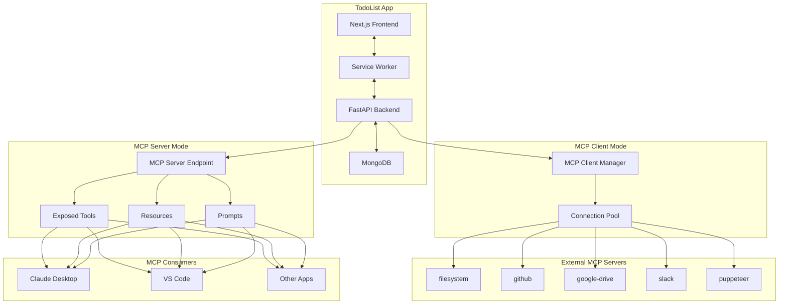

# MCP Integration Proposal for TodoList App

## Executive Summary

This proposal outlines a strategic integration of the Model Context Protocol (MCP) into the TodoList application, positioning it as both an MCP server (exposing productivity tools) and an MCP client (consuming external services). This dual approach will transform the app into a central productivity hub in the MCP ecosystem.

## Current Architecture Overview

### Existing Capabilities
- **AI-Powered Task Management**: GPT-5 categorization and prioritization
- **Collaborative Spaces**: Multi-user workspaces with permission management
- **Smart Journals**: Timestamped entries with search capabilities
- **Intelligent Agent**: Context-aware assistant with tool calling
- **Offline-First PWA**: Service worker with IndexedDB sync
- **Cross-Platform**: Web, iOS, and Android via Capacitor

### Technology Stack
- **Backend**: FastAPI (Python) with MongoDB
- **Frontend**: Next.js with React and TypeScript
- **AI**: OpenAI GPT-4.1 for agent, GPT-5-nano/mini for classification
- **Auth**: JWT-based with email verification

## MCP Integration Strategy

### Phase 1: MCP Server Implementation (Weeks 1-3)

Transform the TodoList app into an MCP server that exposes its productivity tools to the broader ecosystem.

#### Core Tools to Expose

```typescript
// Task Management
add_task(text: string, priority?: string, space_id?: string): Task
list_tasks(filter?: TaskFilter, space_id?: string): Task[]
update_task(id: string, updates: Partial<Task>): Task
search_tasks(query: string, space_id?: string): Task[]

// Journal Management
create_journal_entry(content: string, date?: string, space_id?: string): Entry
read_journal_entries(date_range?: DateRange, space_id?: string): Entry[]
search_journal(query: string, semantic?: boolean): Entry[]

// Space Collaboration
create_space(name: string, members?: string[]): Space
invite_to_space(space_id: string, emails: string[]): InviteResult
get_space_insights(space_id: string, timeframe?: string): Insights

// AI Assistant
get_task_suggestions(context: string): Suggestion[]
categorize_content(text: string, space_id?: string): Category
generate_summary(space_id: string, timeframe: string): Summary
```

#### Implementation Approach

```python
# backend/mcp/server.py
from fastmcp import FastMCP
from typing import Optional, List
import todos
import journals
import spaces
import agent

mcp = FastMCP("todolist-productivity")

@mcp.tool()
async def add_task(
    text: str,
    priority: Optional[str] = None,
    space_id: Optional[str] = None,
    user_id: str = None
) -> dict:
    """Add a task with AI categorization and priority inference"""
    # Leverage existing todos.py functions
    result = await todos.create_todo(
        text=text,
        priority=priority or "medium",
        space_id=space_id,
        user_id=user_id
    )
    return {"ok": True, "task": result}

@mcp.resource("tasks://recent")
async def get_recent_tasks(user_id: str) -> str:
    """Resource endpoint for recent tasks"""
    tasks = await todos.get_todos(user_id=user_id, limit=10)
    return json.dumps(tasks)

@mcp.prompt("productivity_coach")
async def productivity_prompt(context: dict) -> str:
    """Generate personalized productivity coaching based on user data"""
    tasks = await todos.get_todos(user_id=context["user_id"])
    journals = await journals.get_recent_entries(user_id=context["user_id"])
    return f"""Based on your {len(tasks)} active tasks and recent journal entries,
    here are personalized productivity recommendations..."""
```

### Phase 2: MCP Client Integration (Weeks 4-6)

Enhance the app by connecting to external MCP servers for expanded functionality.

#### Priority Integrations

| MCP Server | Use Case | Value Proposition |
|------------|----------|-------------------|
| **filesystem** | File attachments for tasks | Attach documents, images to tasks |
| **github** | Development workflow | Link tasks to PRs, issues, commits |
| **google-drive** | Cloud storage | Backup journals, share documents |
| **slack** | Team communication | Import messages as tasks |
| **puppeteer** | Web automation | Research tasks, content scraping |
| **sqlite/postgres** | Advanced queries | Complex analytics, reporting |
| **brave-search** | Web search | Research assistance |
| **fetch** | API integration | Connect to any REST API |

#### Client Implementation

```python
# backend/mcp/client.py
from mcp import ClientSession, StdioServerParameters
import asyncio
from typing import Dict, Any

class MCPClientManager:
    def __init__(self):
        self.connections: Dict[str, ClientSession] = {}

    async def connect_filesystem(self, base_path: str = "/workspace"):
        """Connect to filesystem MCP server for file operations"""
        server = StdioServerParameters(
            command="npx",
            args=["-y", "@modelcontextprotocol/server-filesystem", base_path]
        )
        async with stdio_client(server) as (read, write):
            async with ClientSession(read, write) as session:
                await session.initialize()
                self.connections["filesystem"] = session
                return session

    async def attach_file_to_task(self, task_id: str, file_path: str):
        """Attach a file to a task using filesystem MCP"""
        fs = self.connections.get("filesystem")
        if not fs:
            raise ValueError("Filesystem MCP not connected")

        # Read file via MCP
        content = await fs.call_tool("read_file", {"path": file_path})

        # Store reference in task
        await todos.update_todo(task_id, {
            "attachments": [{"path": file_path, "name": Path(file_path).name}]
        })
        return {"ok": True, "attachment": file_path}
```

### Phase 3: Advanced Orchestration (Weeks 7-12)

Build sophisticated workflows that combine multiple MCP servers with the app's native capabilities.

#### Example Workflows

**1. GitHub Issue → Task Workflow**
```python
async def github_to_task_sync(repo: str, user_id: str):
    """Sync GitHub issues to tasks"""
    github = await connect_mcp_server("github")

    # Fetch open issues
    issues = await github.call_tool("list_issues", {
        "repo": repo,
        "state": "open",
        "assignee": "@me"
    })

    # Convert to tasks
    for issue in issues:
        await add_task(
            text=f"[GH-{issue['number']}] {issue['title']}",
            priority="high" if "bug" in issue["labels"] else "medium",
            metadata={"github_url": issue["url"]}
        )
```

**2. Research Assistant Workflow**
```python
async def research_task(query: str, user_id: str, space_id: str):
    """Comprehensive research workflow"""
    # 1. Search the web
    search = await connect_mcp_server("brave-search")
    results = await search.call_tool("search", {"query": query})

    # 2. Scrape top results
    puppeteer = await connect_mcp_server("puppeteer")
    contents = []
    for url in results[:3]:
        content = await puppeteer.call_tool("scrape", {"url": url})
        contents.append(content)

    # 3. Summarize with AI
    summary = await agent.summarize_content(contents)

    # 4. Create journal entry
    await create_journal_entry(
        content=f"# Research: {query}\n\n{summary}",
        space_id=space_id
    )

    # 5. Create follow-up tasks
    tasks = await agent.extract_action_items(summary)
    for task in tasks:
        await add_task(task, space_id=space_id)
```

## Architecture Diagram



## Implementation Timeline

### Month 1: Foundation
- **Week 1-2**: Setup FastMCP, implement core task/journal tools
- **Week 3**: Add resource endpoints and prompts
- **Week 4**: Testing with Claude Desktop, documentation

### Month 2: Client Integration
- **Week 5-6**: Implement MCP client manager
- **Week 7**: Filesystem and GitHub integrations
- **Week 8**: Google Drive and Slack integrations

### Month 3: Advanced Features
- **Week 9-10**: Workflow orchestration engine
- **Week 11**: UI for managing MCP connections
- **Week 12**: Performance optimization, testing

## Business Impact

### Revenue Opportunities
- **MCP Server Licensing**: $10-50/month for API access
- **Premium Integrations**: $5-20/month per integration
- **Enterprise Features**: Custom workflows, priority support
- **White-Label Solutions**: Branded MCP servers for organizations

### Competitive Advantages
- **First-Mover**: Early presence in MCP productivity space
- **Network Effects**: More integrations → more users → more integrations
- **AI Differentiation**: Superior task categorization and insights
- **Platform Play**: Become the hub for productivity workflows

### Market Positioning
Position as the **"Zapier of Personal Productivity"** - a central hub that:
- **Provides** essential productivity tools via MCP
- **Connects** to any MCP-enabled service
- **Orchestrates** complex multi-tool workflows
- **Learns** from usage to provide personalized assistance

## Technical Requirements

### Backend Changes
```python
# requirements.txt additions
fastmcp>=0.1.0
mcp>=0.1.0
```

### Configuration
```python
# backend/.env additions
MCP_SERVER_NAME=todolist-productivity
MCP_SERVER_VERSION=1.0.0
MCP_ENABLED_INTEGRATIONS=filesystem,github,google-drive
MCP_MAX_CONNECTIONS=10
```

### API Endpoints
```python
# New endpoints for MCP management
GET  /api/mcp/servers        # List available MCP servers
POST /api/mcp/connect        # Connect to an MCP server
GET  /api/mcp/connections    # List active connections
POST /api/mcp/execute        # Execute tool on connected server
DELETE /api/mcp/disconnect  # Disconnect from server
```

## Security Considerations

### Authentication
- MCP server requires API key authentication
- User-specific tool execution with proper isolation
- Rate limiting per API key

### Data Privacy
- Clear data usage policies for MCP consumers
- Encryption for sensitive journal entries
- GDPR-compliant data export/deletion

### Access Control
- Granular permissions for tool access
- Space-based isolation maintained
- Audit logging for all MCP operations

## Success Metrics

### Phase 1 (Server)
- 100+ downloads from MCP registry
- 10+ active Claude Desktop users
- 5-star rating on MCP hub

### Phase 2 (Client)
- 5+ integrated MCP servers
- 50% reduction in feature development time
- 90% user satisfaction with integrations

### Phase 3 (Platform)
- 1000+ monthly active MCP users
- 20+ third-party integrations
- $10K+ MRR from MCP subscriptions

## Risk Mitigation

| Risk | Mitigation Strategy |
|------|-------------------|
| MCP adoption slow | Maintain existing functionality, MCP as progressive enhancement |
| Security vulnerabilities | Thorough security audit, sandboxed execution |
| Performance issues | Implement caching, connection pooling, async operations |
| Integration complexity | Start with simple integrations, gradual rollout |
| User confusion | Clear documentation, intuitive UI, onboarding flow |

## Next Steps

1. **Technical Validation** (Week 1)
   - Install FastMCP and create proof-of-concept
   - Test with Claude Desktop
   - Benchmark performance

2. **User Research** (Week 1-2)
   - Survey existing users about desired integrations
   - Identify high-value use cases
   - Prioritize integration roadmap

3. **Development Kickoff** (Week 2)
   - Set up MCP development environment
   - Create initial tool implementations
   - Begin documentation

4. **Community Engagement** (Ongoing)
   - Submit to MCP server registry
   - Contribute to MCP discussions
   - Partner with other server maintainers

## Conclusion

Integrating MCP transforms the TodoList app from a standalone productivity tool into a central hub in the AI-powered productivity ecosystem. By implementing both server and client capabilities, the app can:

1. **Expand reach** by exposing tools to thousands of MCP consumers
2. **Enhance functionality** by integrating with best-in-class services
3. **Create moat** through network effects and integration depth
4. **Generate revenue** through API subscriptions and premium features
5. **Future-proof** the architecture for the AI-agent era

This positions the TodoList app to become the definitive productivity platform in the MCP ecosystem, creating sustainable competitive advantage and new revenue streams while delivering exceptional value to users.
