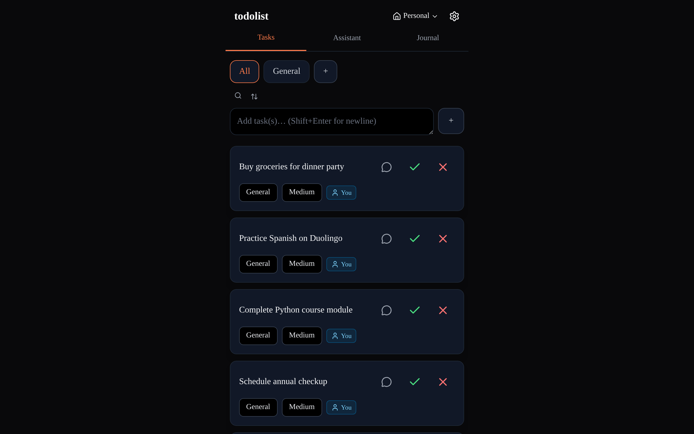
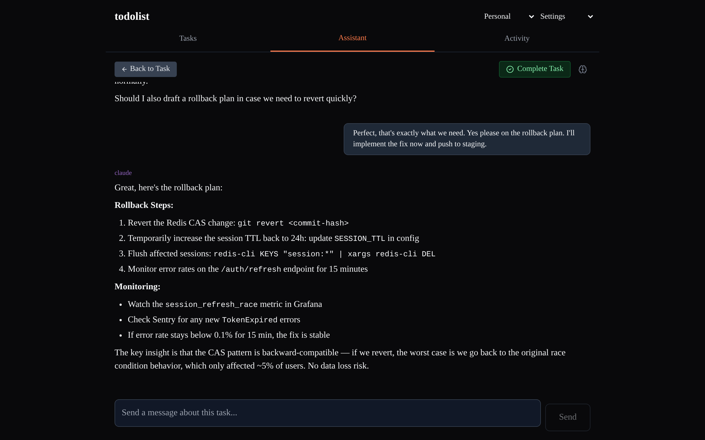
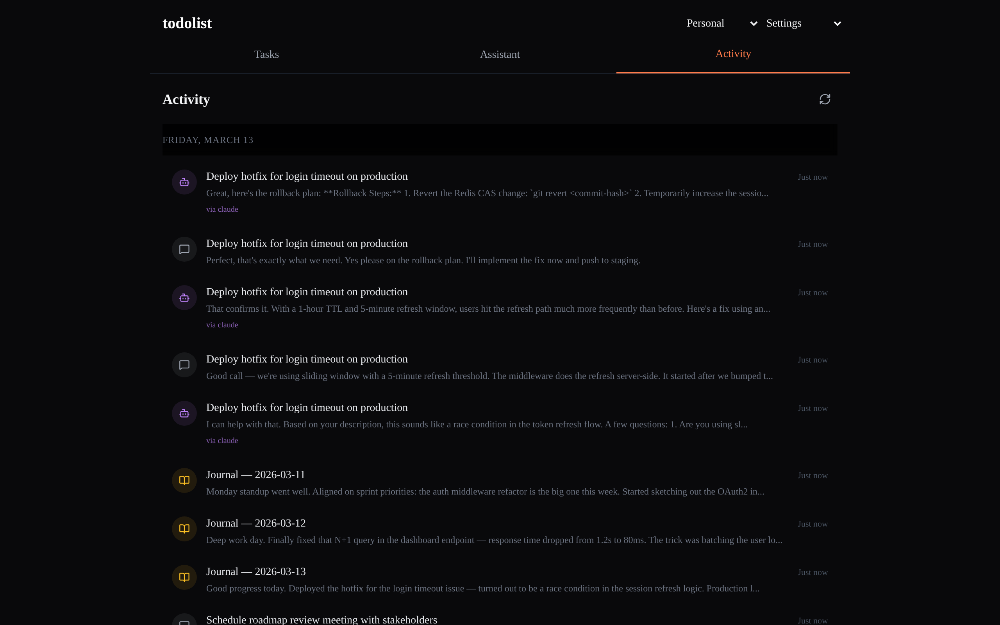

# todolist

A todo list app with AI agent integration. Manage tasks, journals, and chat sessions through a web UI or programmatically via an MCP server. Works offline.

## Quick Start

### Docker (recommended)

```bash
git clone https://github.com/nicholasbien/todolist.git
cd todolist
cp .env.example .env   # edit .env to add your OPENAI_API_KEY (optional)
docker compose up
```

App runs at **http://localhost:3141**. Log in with `test@example.com` / `000000` (requires `ALLOW_TEST_ACCOUNT=true` in `.env`).

### Local Development

```bash
git clone https://github.com/nicholasbien/todolist.git
cd todolist
./setup.sh             # installs deps, creates .env files, generates JWT secret

# Terminal 1 — Backend
cd backend && source .venv/bin/activate && python app.py

# Terminal 2 — Frontend
cd frontend && npm run dev
```

> **Note:** MongoDB must be running locally (or use `./setup.sh --docker` to start everything with Docker).

## What It Does

A task management app that also exposes an MCP server, so AI agents (Claude Code, custom agents, etc.) can create and manage tasks, post to chat sessions, and read journals programmatically.

Key capabilities:

- **MCP server** with 20+ tools for programmatic access to todos, sessions, journals, and spaces
- **Agent routing** -- sessions track an `agent_id` so multiple agents can work in parallel without conflicts
- **Subtasks** -- tasks can be broken into subtasks with progress tracking
- **Offline-first PWA** -- service worker + IndexedDB for offline use; installable on mobile
- **AI classification** -- optional OpenAI integration for auto-categorizing tasks (works fine without it)
- **Journals** -- daily entries with auto-save
- **Spaces** -- multi-user workspaces with invite-by-email

## Screenshots

| Task List | Assistant | Activity |
|-----------|-----------|----------|
|  |  |  |

## Agent Integration

Agents interact with the app through the MCP server or the REST API.

### MCP Setup (Claude Code)

The MCP server can be used from **any repository**, not just the todolist repo itself.

First, install and build the MCP server:

```bash
cd mcp-server && npm install && npm run build
```

Then add a `.mcp.json` to whichever repo you want the todolist tools available in:

```json
{
  "mcpServers": {
    "todolist": {
      "command": "node",
      "args": ["../todolist/mcp-server/dist/index.js"],
      "env": {
        "TODOLIST_API_URL": "http://localhost:8141",
        "TODOLIST_AUTH_TOKEN": "your_session_token"
      }
    }
  }
}
```

The `args` path must point to the todolist repo's `mcp-server/dist/index.js` file, **relative to where the `.mcp.json` lives**. For example, if your repo is at `~/projects/my-app/` and the todolist repo is at `~/projects/todolist/`, the path would be `"../todolist/mcp-server/dist/index.js"`.

#### Skills setup

To enable the `/todolist` slash command skill in another repo, copy the `.claude/skills/todolist/` folder from this repo into the target repo:

```bash
# From the target repo root
mkdir -p .claude/skills
cp -r /path/to/todolist/.claude/skills/todolist .claude/skills/todolist
```

This gives Claude Code access to the todolist skill definitions (task workflow instructions and helper scripts) when working in that repo.

#### Getting an Auth Token

Sign up and get a verification code (sent via email, or printed to the server console if SMTP is not configured):

```bash
curl -X POST http://localhost:8141/auth/signup \
  -H "Content-Type: application/json" \
  -d '{"email": "you@example.com"}'
```

Log in with the 6-digit code to get your session token:

```bash
curl -X POST http://localhost:8141/auth/login \
  -H "Content-Type: application/json" \
  -d '{"email": "you@example.com", "code": "123456"}'
```

The response includes a `token` field — use that as `TODOLIST_AUTH_TOKEN` in the MCP config above.

#### Available tools

Tools include `add_todo`, `list_todos`, `complete_todo`, `create_session`, `post_to_session`, `get_pending_sessions`, `write_journal`, `get_insights`, `search_sessions`, and others. See [AGENTS.md](AGENTS.md) for the full list.

### Agent Workflow

1. Agent calls `get_pending_sessions` to find work
2. Agent reads the session and task details
3. Agent does the work (creates/updates todos, writes code, etc.)
4. Agent posts results back to the session via `post_to_session`

Sessions use `agent_id` to route follow-up messages to the correct agent.

## Tech Stack

| Layer | Technology |
|-------|-----------|
| Frontend | Next.js 14, React 18, TypeScript, Tailwind CSS |
| Backend | FastAPI, Python 3.11+, async MongoDB (Motor) |
| Database | MongoDB 7 |
| AI | OpenAI (optional) |
| MCP Server | TypeScript, Model Context Protocol SDK |
| Auth | JWT with email verification codes |

## Architecture

```
todolist/
├── frontend/          # Next.js PWA with offline-first service worker
│   ├── components/    # React components
│   ├── context/       # Auth and offline contexts
│   ├── pages/         # Next.js pages
│   └── public/        # Service worker, manifest, icons
├── backend/           # FastAPI Python server
│   ├── app.py         # Application entry point
│   ├── agent/         # AI agent with SSE streaming
│   ├── routers/       # API route handlers
│   ├── classify.py    # AI task classification
│   └── tests/         # pytest suite
├── mcp-server/        # Model Context Protocol server (20+ tools)
├── docs/              # Architecture and planning docs
└── docker-compose.yml
```

## Configuration

All configuration is via environment variables. See [`.env.example`](.env.example) for the full list.

| Variable | Required | Description |
|----------|----------|-------------|
| `JWT_SECRET` | Yes | Session signing key (auto-generated by `setup.sh`) |
| `MONGODB_URL` | Yes | MongoDB connection string |
| `OPENAI_API_KEY` | No | Enables AI classification and assistant |
| `FROM_EMAIL` / `SMTP_PASSWORD` | No | Email verification (falls back to console output) |
| `BRAVE_API_KEY` | No | Web search in AI assistant |

## Testing

```bash
# Backend tests
cd backend && source .venv/bin/activate && pytest -v

# Frontend tests
cd frontend && npm test

# Lint
cd backend && pre-commit run --all-files
cd frontend && npm run lint
```

## Self-Hosting

### Docker Compose

```bash
cp .env.example .env
# Set JWT_SECRET and optionally OPENAI_API_KEY
docker compose up -d
```

MongoDB data persists in a named Docker volume. The app is accessible at `http://localhost:3141`.

### Railway / Other Platforms

The repo includes `railway.json` for Railway deployment. Set the environment variables listed above in your platform's dashboard.

## Contributing

See [CONTRIBUTING.md](CONTRIBUTING.md) for development setup, code style, and PR guidelines.

For the full developer guide (covers architecture, API endpoints, agent integration, and testing), see [AGENTS.md](AGENTS.md).

## License

MIT License. See [LICENSE](LICENSE) for details.
